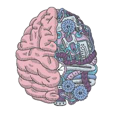

# BrainHack - Your Personal Productivity and Mental Wellness Companion



## Overview

BrainHack is an innovative web application that combines cutting-edge AI technology with neuroscience principles to help users achieve optimal focus and maintain mental wellness. The platform features an interactive brain visualization, AI-powered distraction risk prediction, and an intelligent chat assistant.

## Features

### 1. Interactive Brain Visualization
- Split-brain animation representing the harmony between analytical and creative thinking
- Left hemisphere showcases logical processing in grayscale
- Right hemisphere displays creativity through vibrant colors
- Dynamic animations respond to user interactions
- Custom cursor effects and gradient overlays

### 2. Distraction Risk Predictor
- AI-powered tool that analyzes multiple factors affecting focus
- Input parameters include:
  - Time of day and location
  - Current activity and productive session duration
  - Stress and fatigue levels
  - Recent notifications and phone usage
- Provides personalized risk assessments and actionable recommendations
- Includes a focus timer with customizable session lengths

### 3. AI Chat Assistant
- Powered by Google's Gemini AI
- Provides personalized advice on:
  - Productivity strategies
  - Mental wellness tips
  - Time management techniques
  - Focus improvement methods
- Maintains conversation history for context-aware responses

### 4. User Authentication
- Secure login and registration system
- Firebase authentication integration
- User profile management
- Saved predictions and chat history

## Technology Stack

### Frontend
- **Next.js 15** - React framework for server-rendered applications
- **TypeScript** - Type-safe JavaScript
- **Tailwind CSS** - Utility-first CSS framework
- **Framer Motion** - Animation library
- **GSAP** - Advanced animations
- **AOS** - Scroll animations
- **Three.js** - 3D graphics (for brain visualization)

### Backend
- **Firebase** - Authentication, Firestore database, and hosting
- **Google Gemini AI** - Natural language processing for chat assistant
- **Flask API** - Machine learning model for distraction prediction

## Getting Started

### Prerequisites
- Node.js (v18 or higher)
- npm or yarn
- Firebase account
- Google Gemini API key

### Installation

1. Clone the repository
```bash
git clone https://github.com/Jdsb06/BrainHack.git
cd BrainHack
```

2. Install dependencies
```bash
npm install
```

3. Set up environment variables
Create a `.env.local` file in the root directory with the following variables:
```
# Firebase Configuration
NEXT_PUBLIC_FIREBASE_API_KEY=your_firebase_api_key
NEXT_PUBLIC_FIREBASE_AUTH_DOMAIN=your_firebase_auth_domain
NEXT_PUBLIC_FIREBASE_PROJECT_ID=your_firebase_project_id
NEXT_PUBLIC_FIREBASE_STORAGE_BUCKET=your_firebase_storage_bucket
NEXT_PUBLIC_FIREBASE_MESSAGING_SENDER_ID=your_firebase_messaging_sender_id
NEXT_PUBLIC_FIREBASE_APP_ID=your_firebase_app_id
NEXT_PUBLIC_FIREBASE_MEASUREMENT_ID=your_firebase_measurement_id

# Gemini API Configuration
GEMINI_API_KEY=your_gemini_api_key
```

4. Run the development server
```bash
npm run dev
```

5. Open [http://localhost:3000](http://localhost:3000) in your browser

## Project Structure

```
brain_hack/
├── public/                  # Static assets
├── src/
│   ├── app/                 # Next.js app router
│   │   ├── api/             # API routes
│   │   ├── ask-ai/          # AI chat page
│   │   ├── login/           # Login page
│   │   ├── register/        # Registration page
│   │   ├── risk-predictor/  # Distraction risk predictor page
│   │   └── ...
│   ├── components/          # Reusable UI components
│   ├── lib/                 # Utility functions and Firebase setup
│   └── styles/              # Global styles
├── scripts/                 # Utility scripts
├── .env.local               # Environment variables
├── next.config.js           # Next.js configuration
├── package.json             # Project dependencies
└── README.md                # Project documentation
```

## Deployment

The application is deployed on Firebase Hosting. To deploy:

```bash
npm run build
firebase deploy --only hosting
```

## Contributing

1. Fork the repository
2. Create your feature branch (`git checkout -b feature/amazing-feature`)
3. Commit your changes (`git commit -m 'Add some amazing feature'`)
4. Push to the branch (`git push origin feature/amazing-feature`)
5. Open a Pull Request

## License

This project is licensed under the MIT License - see the LICENSE file for details.

## Acknowledgments

- Google Gemini AI for providing the chat capabilities
- Firebase for authentication and hosting
- The open-source community for the various libraries used in this project


## Meet the BrainHack Team 🧠✨

- 👨‍💻 **Jashandeep Singh Bedi**  
  - 📧 [Email](mailto:jashandeepsingh.b@iiitb.ac.in)  
  - 🔗 [LinkedIn](https://linkedin.com/in/jdsb06)  
  - 🐙 [GitHub](https://github.com/Jdsb06)

- 👩‍💻 **Heer**  
  - 📧 [Email](mailto:heer@iiitb.ac.in)
  - 🔗 [LinkedIn](https://linkedin.com/in/heer-grover)  
  - 🐙 [GitHub](https://github.com/Heer-create-lgtm)

- 👨‍💻 **Lakshay Jain**  
  - 📧 [Email](mailto:lakshya.jain@iiitb.ac.in)
  - 🔗 [LinkedIn](https://linkedin.com/in/lakshayjain)  
  - 🐙 [GitHub](https://github.com/lakshayjain)

